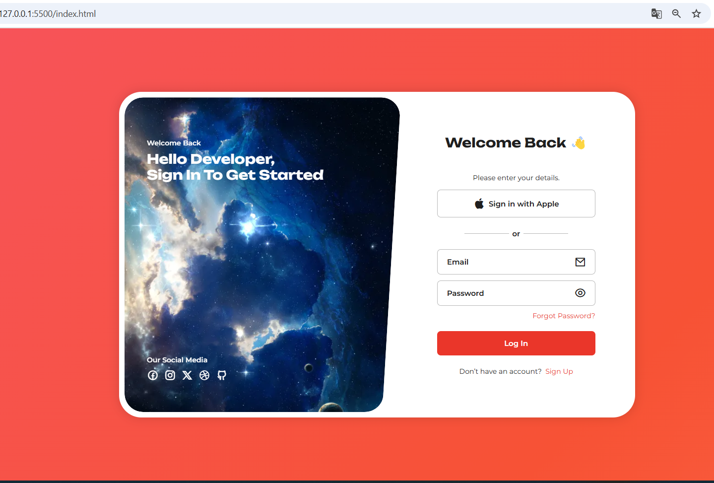

# Responsive Login & Sign-Up Form with Slider Images

A modern **responsive login and sign-up page** with **sliding images**, **show/hide password**, and **animated gradient background**.

## Features

- Fully **responsive** (mobile-first design)
- **Swiper JS** image slider with autoplay and pagination
- **Show/hide password** feature for password fields
- **Social media links** section
- **Animated red gradient background**
- Modern and clean UI inspired by Bedimcode

## Demo




## Technologies Used

- HTML5
- CSS3 (with CSS variables and animations)
- JavaScript (for slider & password toggle)
- [Swiper JS](https://swiperjs.com/)
- [Remix Icons](https://remixicon.com/)

## Folder Structure

```

responsive-login-signup/
│
├─ assets/
│   ├─ images/
│   ├─ style.css
│   └─ main.js
│
├─ index.html
├─ signup.html
└─ README.md

````

## How to Use

1. Clone the repository:

```bash
git clone https://github.com/abdellahaarab/Responsive-Login-Sign-Up-Form-with-Slider-Images.git
````

2. Open `index.html` or `signup.html` in your browser.
3. Ensure all images are in `assets/images/`.
4. Enjoy your fully responsive login and sign-up page!

## License

This project is licensed under the MIT License.

````

---


